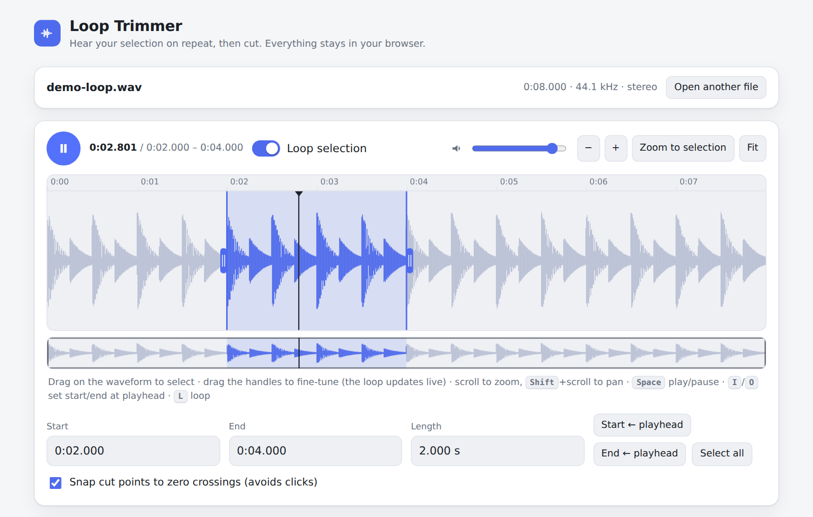

# Loop Trimmer

A tiny browser-based audio trimmer with one feature most trimmers lack: **you can loop the selected range while you adjust it, *before* you cut.**

Drag the handles and hear the loop change live, so you can find the exact bar/beat/word boundary by ear. Then export the selection as MP3, OGG or WAV with a quality setting that fits your size budget — handy for optimizing audio for playable ads, web games and other size-constrained projects.

Everything runs locally in your browser. Nothing is uploaded.



## Features

- **Loop preview of the selection** — toggle *Loop selection* and drag the start/end handles; the loop follows you in real time (sample-accurate loop points via Web Audio).
- **Waveform editor** — drag to select, drag the handles to fine-tune, drag the selection body to move it, scroll to zoom, Shift+scroll to pan, overview strip for navigation.
- **Precise numeric start/end** (`m:ss.mmm`, arrow keys nudge ±10 ms, Shift ±100 ms).
- **Snap to zero crossings** so cuts and loop points don't click.
- **Export quality control**
  - **MP3** (LAME): CBR 32–320 kbps or VBR V0–V8
  - **OGG Vorbis**: quality −1 … 10 (≈45–500 kbps)
  - **WAV**: 8 / 16 / 24-bit or 32-bit float
  - Sample rate (8–48 kHz), mono downmix, fade in / fade out, peak normalization
  - Live **estimated file size** and one-click presets (*Tiny (playables)*, *Small*, *Balanced*, *Lossless*)
  - The exported file can be auditioned right on the page.
- Works offline once loaded, no build step, no dependencies to install.

## Keyboard shortcuts

| Key | Action |
| --- | --- |
| `Space` | Play / pause |
| `L` | Toggle loop |
| `I` / `O` | Set selection start / end at the playhead |
| `Home` | Playhead to selection start |
| `+` / `-` / `0` | Zoom in / out / fit |

## Run it

It's a static page. Either open `index.html` directly, or serve the folder:

```bash
python3 -m http.server 8000
# open http://localhost:8000
```

## Publish with GitHub Pages

1. Create a repository and push this folder to the `main` branch.
2. In the repo go to **Settings → Pages** and set **Source** to **GitHub Actions**.
3. The included workflow (`.github/workflows/pages.yml`) deploys on every push. Your tool will be live at `https://<your-username>.github.io/<repo-name>/`.

Optional: set `REPO_URL` near the top of the `<script>` in `index.html` to show a GitHub link in the header.

## Project layout

```
index.html                     the whole app (HTML + CSS + JS)
vendor/
  wasm-media-encoders.min.js   MP3/OGG encoder wrapper
  mp3-wasm.js, ogg-wasm.js     LAME / libvorbis compiled to WebAssembly (base64)
docs/screenshots/              put screenshots here
.github/workflows/pages.yml    GitHub Pages deploy
```

The encoders are loaded lazily the first time you export MP3 or OGG, so the initial page load stays small.

## Notes

- Decoding uses the browser's `decodeAudioData`, so supported input formats depend on your browser. Audio is resampled to the audio device's sample rate on load (typically 44.1 or 48 kHz); "Same as source" in the export panel refers to that rate.
- MP3 files include a short encoder delay/padding, so their duration can be a few ms longer than the selection. Use OGG or WAV if you need sample-exact length.
- Very long files are held decoded in memory (≈ 10 MB per minute of stereo audio at 44.1 kHz).

## Credits & licenses

- App code: [MIT](LICENSE).
- [`wasm-media-encoders`](https://github.com/arseneyr/wasm-media-encoders) (MIT) — packages the [LAME](https://lame.sourceforge.io/) MP3 encoder (LGPL) and [libvorbis / libogg](https://xiph.org/vorbis/) (BSD) as WebAssembly. See `vendor/LICENSE-wasm-media-encoders.txt`. LAME is LGPL-licensed; the WASM binary is shipped as a separate, replaceable file in `vendor/`.
